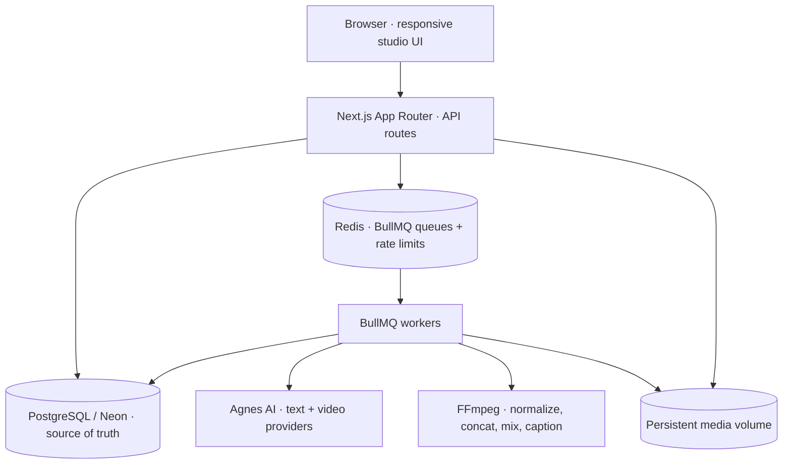

# Brio

A private studio for generating cinematic educational videos for TikTok, YouTube Shorts, Instagram Reels and YouTube. Give it a topic and it plans a creative brief, writes narration-first script timing, builds a storyboard, generates many short Agnes AI video clips, and assembles them into one finished vertical MP4 with narration, mixed audio and burned-in captions.

The fundamental rule: **the timeline is driven by narration**. A three-to-five minute video is never one AI request — it is dozens of short shots generated independently and assembled server-side.

## Architecture



- PostgreSQL is the source of truth. Every job also exists as a `jobs` row, so a Redis restart only delays work — it never loses it.
- Redis holds BullMQ queues, delayed retry/poll scheduling and short-lived rate-limit counters.
- The web process and the worker process mount the same `DATA_DIR` volume, so generated media is never trapped in a temporary container filesystem.

### Generation pipeline

```text
topic → creative brief → script → narration-first shot timing → storyboard
     → shots (4–12 s each) → Agnes text-to-video / keyframe / reference
     → clip storage + thumbnails → composition object → FFmpeg assembly
     → captions, narration, ducked music → MP4 + thumbnail → render record
```

## Tech stack

Next.js (App Router) · TypeScript · Tailwind CSS · shadcn-style UI primitives with Iconsax icons · pnpm · Zod · PostgreSQL on Neon with Drizzle ORM · Better Auth magic links · Resend · BullMQ with Redis · FFmpeg · Docker Compose · Vitest · GitHub Actions.

## Prerequisites

- Node.js 22+ (verified on Node 26) and pnpm 12.6.0 (`corepack prepare pnpm@12.6.0 --activate`, or `npm i -g pnpm@12.6.0`)
- A Neon PostgreSQL database
- Redis (Docker Compose provides one, or bring an external `REDIS_URL`)
- FFmpeg 6+ available on `PATH` for local development (the Docker image installs it)
- An Agnes AI API key, a Resend API key and a verified Resend sender domain

## Environment variables

Copy `.env.example` to `.env` and fill it in. Never commit `.env`.

Media storage runs on the local disk by default. To keep media in Cloudinary instead, set
`STORAGE_DRIVER=cloudinary` with `CLOUDINARY_CLOUD_NAME`, `CLOUDINARY_API_KEY` and
`CLOUDINARY_API_SECRET` (details in `docs/storage.md`); the FFmpeg working copy, the authenticated
`/api/media/<id>` route and the render pipeline all keep working unchanged.

| Variable | Purpose |
| --- | --- |
| `DATABASE_URL` | Neon pooled PostgreSQL connection string |
| `REDIS_URL` | Redis connection string used by BullMQ |
| `BETTER_AUTH_SECRET` | 32+ character secret; also signs expiring reference-media URLs |
| `BETTER_AUTH_URL` | Absolute application URL used by Better Auth |
| `NEXT_PUBLIC_APP_URL` | Public URL of the app (required for Agnes reference media) |
| `RESEND_API_KEY` | Resend API key used server-side for magic links |
| `RESEND_FROM_EMAIL` | Verified Resend sender, for example `Brio <no-reply@your-domain>` |
| `AGNES_API_KEY` | Agnes AI API key |
| `AGNES_BASE_URL` | Defaults to `https://apihub.agnes-ai.com/v1` |
| `AGNES_TEXT_MODEL` | Defaults to `agnes-2.5-flash` |
| `AGNES_VIDEO_MODEL` | Defaults to `agnes-video-2.5` |
| `VIDEO_GENERATION_CONCURRENCY` | Concurrent shot generations per worker (default 3) |
| `RENDER_CONCURRENCY` | Concurrent FFmpeg renders per worker (default 1) |
| `STORAGE_DRIVER` | `local` (default) or `cloudinary` |
| `CLOUDINARY_*` | Cloud name, API key, API secret, folder, delivery type — see `docs/storage.md` |
| `DATA_DIR` | Persistent media directory (default `data`, `/app/data` in Docker) |

## Setup

1. **Neon** — create a project, copy the pooled connection string into `DATABASE_URL`.
2. **Better Auth** — the Drizzle adapter and magic-link plugin are wired in `src/auth/index.ts`. Generate `BETTER_AUTH_SECRET` with `openssl rand -base64 48`.
3. **Resend** — create an API key, verify a sending domain, and set `RESEND_FROM_EMAIL` to an address on that domain. Sign-in emails are sent server-side only, with a 10-minute expiry.
4. **Redis** — `docker compose up -d redis` for local work, or point `REDIS_URL` at an external instance.
5. **Agnes** — set `AGNES_API_KEY`. The adapter follows the current official documentation; see `docs/provider-contract.md`.
6. **FFmpeg** — `apt-get install ffmpeg` (or use the Docker image) and confirm `ffmpeg -version`.
7. **Media directory** — set `DATA_DIR` to a persistent path shared by web and worker.

## Database migrations

```bash
pnpm db:generate     # generate SQL from src/db/schema.ts after schema changes
pnpm db:migrate      # apply committed migrations (runs drizzle/ against DATABASE_URL)
pnpm db:studio       # optional inspection UI
```

Migrations are committed under `drizzle/`. Never edit Neon tables by hand.

## Local development

```bash
pnpm install
pnpm db:migrate
pnpm dev       # Next.js on http://localhost:3000
pnpm worker    # required in a second terminal: BullMQ workers + reconciliation
```

Always run the worker alongside the web process; planning, shot generation and rendering all happen in the worker.

| Script | Purpose |
| --- | --- |
| `pnpm dev` | Next.js development server |
| `pnpm worker` | BullMQ workers, delayed polling and outbox reconciliation |
| `pnpm build` / `pnpm start` | Production build and server |
| `pnpm lint` / `pnpm typecheck` / `pnpm test` | Quality gates |
| `pnpm db:generate` / `pnpm db:migrate` / `pnpm db:studio` | Drizzle workflows |

## Docker

```bash
docker compose up --build          # web + worker + Redis + shared media volume
docker compose exec web pnpm db:migrate
```

The image installs FFmpeg and DejaVu fonts (captions). Compose exposes the app on `127.0.0.1:3000` only, keeps Redis behind an internal network, and persists both media and Redis data in named volumes. Compose overrides `REDIS_URL` for its own containers (`COMPOSE_REDIS_URL`, default `redis://redis:6379`) while your `.env` value keeps working for local `pnpm dev` and `pnpm worker`. Production expects an external `DATABASE_URL` (Neon); PostgreSQL is deliberately not containerized.

For local work without Compose:

```bash
docker run -d --name ai-video-studio-redis -p 127.0.0.1:6397:6379 redis:7-alpine
# then set REDIS_URL=redis://127.0.0.1:6397 in .env
```

## Production deployment

Target a normal containerized VPS (Coolify, Dokploy, plain Compose). The app needs persistent workers, Redis, FFmpeg and persistent media storage, so serverless function platforms are not a good fit.

1. Provision PostgreSQL (Neon) and Redis (managed or container with a volume).
2. Set every variable from the table above, using `https://` for `BETTER_AUTH_URL` and `NEXT_PUBLIC_APP_URL`.
3. Mount a persistent volume at `/app/data` on both `web` and `worker`.
4. Run `pnpm db:migrate` once per release, then start `web` and `worker`.
5. Put a TLS reverse proxy in front of the app. The reference-media endpoint requires public HTTPS so Agnes can fetch uploaded reference images.

## Repository structure

```text
src/app/            routes: (studio) shell, auth pages, API route handlers
src/components/     UI: dashboard, new generation, editor, characters, settings, primitives
src/domain/         framework-free rules: shot planning, storyboard validation, progress, composition
src/db/             Drizzle client, schema and migration runner
src/generations/    repository (ownership-scoped reads), transactional commands, HTTP service
src/providers/      Agnes text/video adapter behind provider interfaces
src/storage/        storage drivers (local, Cloudinary), signed URLs, SSRF-safe download, uploads
src/render/         FFmpeg process wrapper, normalization, concat, audio mix, captions, thumbnails
src/queues/         BullMQ queues and Redis client
src/workers/        planning, shot, rendering, cleanup handlers and outbox reconciliation
tests/              focused Vitest suites for the parts most likely to break
scripts/            preflight, smoke and verification entry points
docs/               provider contract and verification report
drizzle/            committed SQL migrations
```

## Generation pipeline details

- **Creative brief, script and storyboard** are produced by the Agnes text model and validated with Zod. Invalid output gets one structured repair attempt, then a bounded regeneration, then a clean failure.
- **Shot planning** (`planShotDurations`) balances shots between 4 and 12 seconds and never leaves an unusably short remainder.
- **Narration is authoritative.** If a narration recording is uploaded, its real duration drives the timeline; otherwise estimated speech duration (≈145 words per minute) is used.
- **One shot at a time.** A single failed or disliked shot can be regenerated without touching completed clips; the previous clip stays in storage for rollback.
- **Idempotent, durable jobs.** Stable database-backed job IDs, persisted submission intent, explicit `UNCERTAIN` states when a submit times out, bounded retries with exponential backoff and a monotonically versioned shot/render model prevent duplicate expensive generations.
- **SSRF-safe media.** Reference images are exposed to Agnes only through expiring HMAC-signed URLs, and provider downloads pin the resolved public address.
- **Captions** are derived from the script and the known timeline, rendered by FFmpeg with a mobile-safe lower margin and high-contrast styling.

## Verification

See `docs/verification.md` for the acceptance matrix, the exact commands that were executed, and the provider checks that could not be live-tested with the supplied credentials.

```bash
pnpm exec tsx scripts/preflight.ts        # database, Resend and configuration probe
pnpm exec tsx scripts/auth-smoke.ts       # magic-link identity, single-use link, session
pnpm exec tsx scripts/render-smoke.ts     # real multi-shot FFmpeg render with captions and audio mix
pnpm exec tsx scripts/workflow-smoke.ts   # full BullMQ workflow against the real database
pnpm exec tsx scripts/live-agnes.ts       # live Agnes text call and a single minimal video attempt
pnpm exec tsx scripts/ui-fixture.ts       # optional labelled demo project for UI review (add `clean` to remove)
pnpm exec tsx scripts/db-counts.ts        # table inventory
pnpm exec tsx scripts/clean-fixtures.ts   # remove any reserved @example.invalid verification residue
```

Every verification script creates and removes its own reserved `@example.invalid` identity, so the database is left exactly as it was found.

## Scope

Publishing to TikTok or YouTube, analytics, billing, teams, AI music generation and collaborative editing are intentionally outside this MVP.
